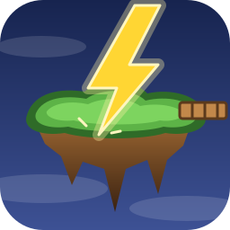

# Islefall

A real-time strategy game of floating islands, bridges and priests, in the
spirit of *NetStorm: Islands at War* (Titanic Entertainment, 1997). Written
from scratch in Rust on top of [Bevy](https://bevy.org).

Islefall ships **no game data**. It reads sprites, palettes and unit
definitions from a NetStorm installation you already own, in the way OpenRA
and OpenTTD use their original games' assets. See `NOTICE`.

Status: early development. The demo map is playable against three
computer players; there is no campaign yet.

## Layout

| Path | What |
|------|------|
| `crates/islefall-data` | Loaders for the original data files (sprite cache, palettes, the `netstorm.tarc` archive and its `.type` unit definitions). No engine dependency. |
| `crates/islefall-sim` | The deterministic simulation: grid, islands, later units and rules. No engine dependency. |
| `crates/islefall` | The game binary, built on Bevy. Currently draws a first island scene and doubles as a sprite viewer. |
| `docs/FORMATS.md` | Reverse-engineered descriptions of the NetStorm file formats. |
| `docs/RULES.md` | How the type flags are read as game rules, with confidence notes. |
| `docs/MODDING.md` | The data directory: `rules.toml`, the Rhai hooks and map files. |
| `data/` | The game's own rules, scripts and maps; nothing from NetStorm. |
| `tools/shp_decode.py` | Python reference decoder used while working out the sprite format. |

## Building

Requires Rust 1.85 or newer and Bevy's Linux dependencies (on Fedora:
`alsa-lib-devel systemd-devel wayland-devel libxkbcommon-devel`).

```sh
cargo build --release
```

The first Bevy build takes several minutes. For faster iteration during
development:

```sh
cargo run --features dynamic_linking
```

## Running

Point `NETSTORM_DIR` at the directory that contains the game's `d/` folder
and `netstorm.tarc`:

```sh
NETSTORM_DIR=~/games/NetStorm cargo run --release
```

Rules, scripts and maps are loaded from `data/` (or `ISLEFALL_DATA`); see
`docs/MODDING.md`. By default this shows the `demo` map (`ISLEFALL_MAP`
picks another from `maps/`; `range` is a shooting range for turret
animations; a name that is no file loads the original's campaign scenario
of that name from the archive, `capturethepriest` say, see `docs/FORT.md`;
`random` or `random:<seed>` makes a battlefield up for `ISLEFALL_PLAYERS`
players, and `ISLEFALL_MAP_EXPORT=file.toml` writes whatever was loaded
as a map file), with all four
factions on it: your Sun home island with the altar, the Temple, a Sun
Workshop (picking a building tool puts that unit into production there),
a Disc Thrower, a Cannon and a Stone Tower, a bridge to a battery on its
own islet, a neutral Storm Geyser island, a Wind island to the east, and
Rain and Thunder islands far to the south, each with its Workshop, Temple,
shooters, Generator, tower, barricade, air base, walker and High Priest.
The three computer players bridge towards your altar and drop shooters on
the way; the islands are close enough for the cannons to reach their
neighbours, so the fight is on from the start, though your home island
lies just outside every reach. Click the minimap to jump
between them. Two of your units walk under the simulation's control. Structures shoot enemies in range; damaged things
show a health bar, destroyed ones explode and crack nearby bridges.
The controls follow the original: take something in hand, left-click
to put it down, right-click to turn a bridge piece, `Escape` to put it
back; the hand is empty again once it is placed. With an empty hand,
left-click on a unit selects it (a pulsing ring round its feet shows
which), left-click elsewhere sends the selected unit
there along a path around obstacles, left-click on a Storm Geyser sets it
harvesting crystals to the Temple, left-click on a stunned enemy priest sends
the selected golem to capture him, left-click on an Obelisk sends it to
learn the Spell there (`X` casts it, `Y` sets a High Priest praying for
his own), and left-click on your altar while he is
carried sacrifices him for Knowledge. The panel on the left shows the Storm Power, the piece queue (click a
slot to take a piece), the build list (click an entry to take it as the
tool) and a minimap (click to look there). The corner text and the window title show the Storm Power
reserve, Knowledge, the tool in hand and the last thing the game had to
say; sacrifice the enemy High Priest to win; drops cost their type's price and stand as translucent shells
until a stream of Storm Power from your Temple, Workshop or Outpost has
built them, which needs connected ground. To take something in hand:
`Q`, `W`, `A`, `S` (or a click on the slot) pick one of the four bridge
pieces on offer (`R` or the right button rotates it), `1` to `6` a sun
cannon, archer, battery, factory, tree or wind generator (the last needs
Knowledge from a sacrifice) and `7` an Outpost for claiming the neutral
island, `U` a golem and `I` a balloon, which flies anywhere; then
left-click where it goes. A piece must touch the edge of your own island
or the open end of your bridge. `Delete` destroys the bridge cell under the cursor, `C`
cracks it, `H` hardens it, `V` salvages your structure under the cursor, `G` upgrades the Workshop under it; unsupported bridges crack and crumble, taking
whatever stands on them. Drops follow the rules in `docs/RULES.md`, including Energy: the rings
around the Temple and Generators show where units can be placed. Arrow
keys pan the camera (the letter keys are for the piece slots) and `-` / `=` zoom.
`ISLEFALL_MODE=viewer` instead
animates one object type at a time: `[` and `]` step through types, `,` and
`.` through its animations. In both modes `Space` pauses and `P` saves a
screenshot; `ISLEFALL_SCREENSHOT=file.png` saves one automatically after
start-up; `ISLEFALL_CAMERA=x,y` and `ISLEFALL_ZOOM=z` choose where it
starts looking. `ISLEFALL_PALETTE` selects a palette file stem from `d/` (default
`gifcloud`, which is the game's fixed 8-bit palette). The sky is generated from seeded noise. Sounds come from the
installation's `sound/` directory through Bevy's built-in audio; the
`[sounds]` section of the rules says what each event plays, how sounds
fade towards the edge of the view and with zoom, which objects hum, and
what the sky sounds like. `ISLEFALL_VOLUME=0` silences a run.
`F5` saves the world as a snapshot and `F9` loads it back.
To play over a network, run the server and join it from each machine
with the same data directory:

```sh
cargo run --release -p islefall-server            # listens on 0.0.0.0:7777
ISLEFALL_JOIN=host:7777 ISLEFALL_NAME=Peter cargo run --release
```

The game starts once every player has connected (two by default; a
`server.toml` argument sets `bind`, `turn_ticks`, `min_players`,
`max_players` and `hash_every_turns`). Clients report world hashes and the
server tells everyone if they ever disagree.
`ISLEFALL_RECORD=game.toml` records every command you give and
`ISLEFALL_REPLAY=game.toml` plays it back; see `docs/NETWORK.md` for how
that underpins network play.

## Inspecting the data

`shpdump` prints statistics for the sprite cache or renders a shape to a PNG
sheet:

```sh
cargo run -p islefall-data --bin shpdump -- stats "$NETSTORM_DIR/d/_shapes.shp"
cargo run -p islefall-data --bin shpdump -- sheet "$NETSTORM_DIR/d/_shapes.shp" 88 walker.png --col "$NETSTORM_DIR/d/SUNCANNON.COL"
cargo run -p islefall-data --bin shpdump -- export "$NETSTORM_DIR" /tmp/sheets sunwalker
```

`export` writes a type's sprites as a PNG plus a TOML frame index, the form
a mod uses to replace them (see `docs/MODDING.md`).

`tarcdump` lists or extracts the text archive and parses all unit definitions:

```sh
cargo run -p islefall-data --bin tarcdump -- types "$NETSTORM_DIR/netstorm.tarc"
cargo run -p islefall-data --bin tarcdump -- cat "$NETSTORM_DIR/netstorm.tarc" sunwalker.type
```

Decoders treat the input as untrusted: sizes come from the decoded data, not
from headers, and every raster is capped. Running exploratory tools under a
memory limit is still a good habit:

```sh
systemd-run --user --scope -p MemoryMax=8G cargo test -p islefall-data
```

Set `NETSTORM_DIR` when running the tests to include the checks against the
real files.

## License

Apache-2.0. See `LICENSE` and `NOTICE`.
